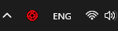
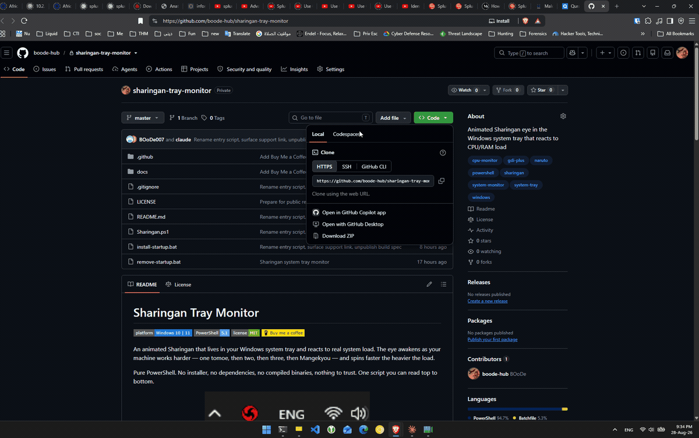
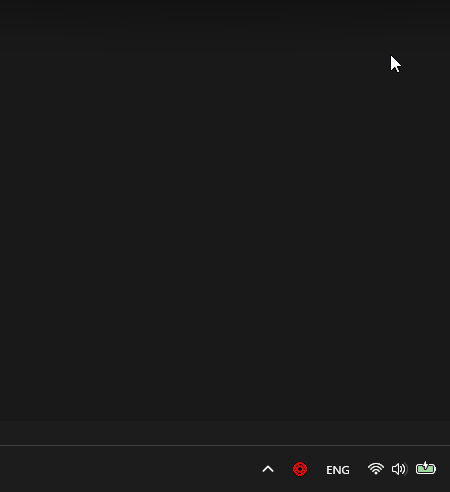

# Sharingan Tray Monitor

[](#requirements)
[](#requirements)
[](LICENSE)
[](https://buymeacoffee.com/boode)

An animated Sharingan that lives in your Windows system tray and reacts to real
system load. The eye awakens as your machine works harder — one tomoe, then two,
then three, then Mangekyou — and spins faster the heavier the load.

Pure PowerShell. No installer, no dependencies, no compiled binaries, nothing to
trust. One script you can read top to bottom.

<p align="center">
  
  <br>
  <em>Real capture from the tray — dormant, then awakening as the machine works.</em>
</p>

<p align="center">
  <a href="https://buymeacoffee.com/boode">
    
  </a>
</p>

## Download and install

Nothing to compile and no installer. Never used GitHub before? Just follow along:

<p align="center">
  
</p>

1. Click the green **Code** button near the top of this page, then **Download ZIP**.
2. Right-click the downloaded ZIP, choose **Extract All**, and pick any folder.
3. Open that folder, right-click **Sharingan.ps1**, and choose **Run with PowerShell**.

The eye appears in your system tray straight away. Right-click it for the menu.

> **If Windows blocks it:** right-click the ZIP *before* extracting, choose
> **Properties**, tick **Unblock**, then extract. Windows flags files downloaded
> from the internet, and this clears that flag.

**Prefer the command line?**

```
powershell -ExecutionPolicy Bypass -File Sharingan.ps1
```

**Want it to start automatically when you log in?**

Double-click `install-startup.bat`. Undo it any time with `remove-startup.bat`,
which also stops the running instance. Neither needs administrator rights.

## How it reacts

| CPU / RAM load | Eye |
| --- | --- |
| below 15% | dormant — no tomoe |
| 15% | 1 tomoe |
| 35% | 2 tomoe |
| 55% | 3 tomoe |
| 75% | Mangekyou |

Every threshold is adjustable. Stages blend smoothly rather than snapping — the
morph is a floating-point value and every element scales off it, so the eye grows
into each stage instead of popping.

## Using it

Right-click the tray icon:

```
Swap to RAM Tracking       toggle between CPU and RAM
Eyes                    >  18 Sharingan styles
Customize               >  Thresholds  >  1st / 2nd / 3rd Tomoe, Mangekyou
                        |  Color       >  10 presets + full colour picker
                        |  Speed       >  0.20x .. 3.00x rotation
                        |  Shuffle     >  cycle eyes randomly, on a timer
                        |  Glow           makes the colour glow
                        |  Reset to Defaults
Buy me a coffee            opens the support page in your browser
Exit
```

Everything applies live. Settings persist to `settings.json` next to the script.

<p align="center">
  
  <br>
  <em>Every setting lives in the tray menu — no separate settings window.</em>
</p>

## The eyes

Itachi · Obito · Kakashi · Madara · Izuna · Sasuke · Shisui · Indra · Shin ·
Sarada · Naka · Baru · Rai · Naori · Fugaku · Nanashi · Madara Eye 2 ·
Sasuke Eye 2

All eighteen are drawn from scratch with GDI+ at 128×128 and scaled down by
Windows, which is what keeps them sharp at tray size. Every one rotates, and
every pattern grows out of nothing as the stage builds.

## Requirements

- Windows 10 or 11
- Windows PowerShell 5.1 (ships with Windows — nothing to install)

## How it works

The interesting parts, if you want to read the source:

- **Load sampling** — `PerformanceCounter("Processor", "% Processor Time", "_Total")`
  for CPU, so the numbers match Task Manager, and `GlobalMemoryStatusEx` for RAM.
- **The morph** — load maps to a target stage, and the current stage eases toward
  it each frame. That easing is why the eye flows between stages.
- **Rendering** — every frame draws a fresh 128×128 bitmap. Tomoe tails and
  Mangekyou blades are runs of overlapping circles, which is crude but
  anti-aliases beautifully.
- **The tray pipeline** — a WinForms `Timer` under a real message pump at ~28fps,
  disposing the previous icon and calling `DestroyIcon` on every frame. Skipping
  that leaks GDI handles until the process dies.

## Support

This is free and always will be — every feature, no paywalls, no nags.

If it made your taskbar better and you'd like to say thanks:

<a href="https://buymeacoffee.com/boode"></a>

Entirely optional, and it changes nothing about the software.

## Disclaimer

Unofficial fan software. Not affiliated with, endorsed by, or sponsored by
Masashi Kishimoto, Shueisha, TV Tokyo, or Viz Media.

"Sharingan", "Mangekyou Sharingan" and the character names are the intellectual
property of their respective owners. This project ships **no** artwork, audio or
other assets from any Naruto work — every graphic is generated at runtime by the
drawing code in this repository. The code is MIT licensed; see `LICENSE`.
